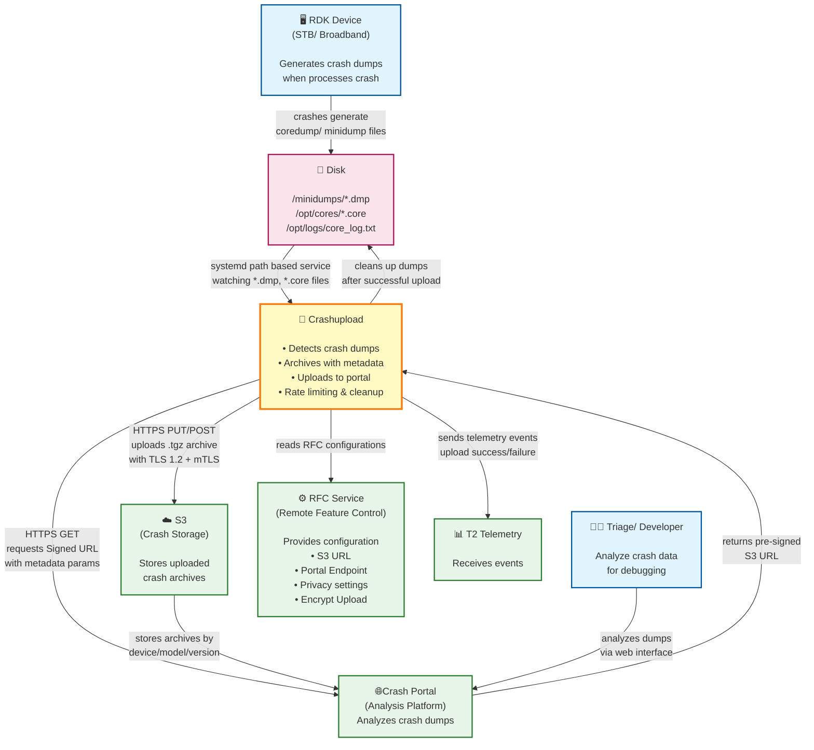
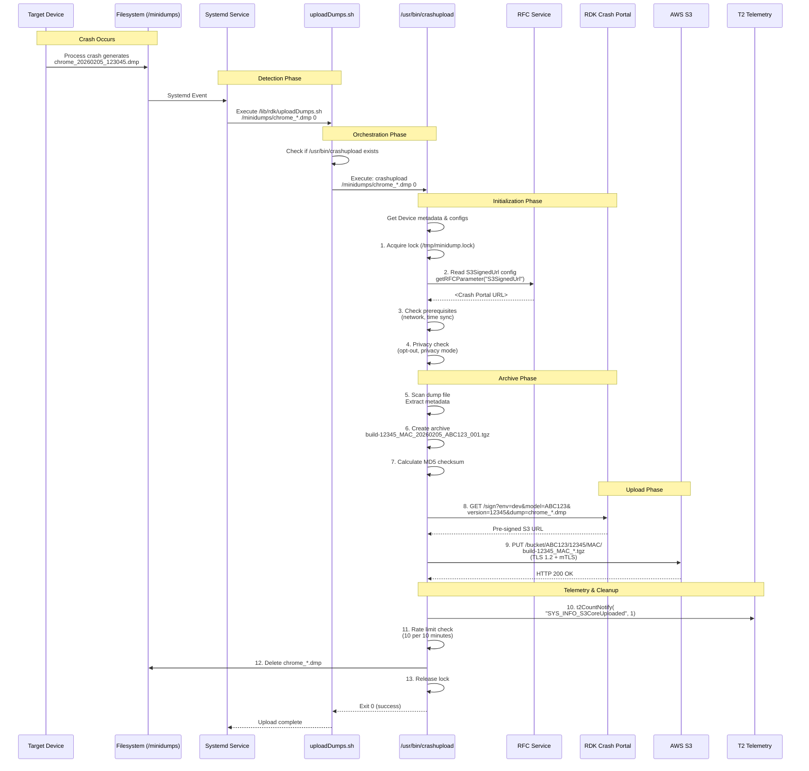

# Crashupload - Brief Architecture

**Repository**: https://github.com/rdkcentral/crashupload 

---

## 1. Overview

### System Purpose
The **Crashupload** component is a crash management and reporting system for RDK devices. It automatically detects, archives, and uploads crash dump files (coredumps and/ or minidumps) from STBs, Broadband, and other RDK devices to a centralized crash portal for analysis and debugging.


### Key Capabilities
- **Automated Crash Detection**: Monitors directories for coredump (`.core`) and minidump (`.dmp`) files using systemd unit files.
- **Smart Archive Creation**: Compresses crash dumps with metadata (MAC address, firmware version, device model, timestamp)
- **Secure Upload**: Uploads crash archives to S3 via signed URLs with TLS 1.2, retry logic, and rate limiting
- **Privacy-Aware**: Respects opt-out settings and privacy mode configurations via RFC 
- **Telemetry Integration**: Reports upload status and errors via Telemetry 2.0
- **Rate Limiting**: Prevents excessive uploads with recovery mode detection

---

## 2. Problem Definitions & Business Context

### Problems Solved

#### 1. **Manual Crash Data Collection**
**Before**: Engineering teams had to manually extract crash dumps from devices via SSH or remote access, a time-consuming and often incomplete process.

**Solution**: Automated crash detection, archival, and upload within minutes of crash occurrence, ensuring no crash data is lost.

#### 2. **Limited Crash Visibility Across Fleet**
**Before**: Crashes on Premise devices went unnoticed, making it difficult to identify widespread issues or patterns.

**Solution**: Centralized crash portal receives dumps from all configured devices, providing fleet-wide visibility into crash patterns, affected firmware versions, and device models.

#### 3. **Storage Constraints on Minimal Devices**
**Before**: Crash dumps accumulated on devices with limited storage, causing disk full conditions and service degradation.

**Solution**: Automatic cleanup after successful upload, with configurable retention policies and batch cleanup operations.

#### 4. **Inconsistent Metadata and Contextual Information**
**Before**: Crash dumps lacked context (firmware version, device configuration, timestamp), making root cause analysis difficult.

**Solution**: Enriched crash archives with device metadata, firmware version, build type, MAC address, and accurate timestamps.

#### 5. **Network Resilience and Upload Reliability**
**Before**: Network interruptions caused upload failures, resulting in lost crash data.

**Solution**: Type-aware retry logic, exponential backoff, prerequisite checks and persistent state management.

### Business Requirements

#### Functional Requirements
- **1**: Detect new crash dumps within 30 seconds of creation
- **2**: Support coredumps (`.core`) and minidumps (`.dmp`) formats
- **3**: Include device metadata in uploaded archives (MAC, firmware, model, timestamp)
- **4**: Respect user privacy settings and opt-out configurations
- **5**: Rate limit uploads to prevent network congestion (10 per 10 minutes)
- **6**: Clean up local dumps after successful upload
- **7**: Provide upload status via telemetry (T2 events)

#### Non-Functional Requirements
- **1**: Minimal binary size
- **2**: Use TLS 1.2 for uploads, support mTLS authentication
- **3**: Compiled C/C++ code for better performance and maintainability compared to shell scripts
- **4**: Logging all events and operations

---

## 3. Architecture Diagram

### External Integrations



### Integration Details

| External System | Protocol | Direction | Data Exchanged | Purpose |
|----------------|----------|-----------|----------------|---------|
| **RFC Service** | TR-181 Data Model / File I/O | Inbound | Configuration values (S3 Signing Url, Portal Endpoint, Encrypt Upload, Privacy settings) | Retrieve remote configuration |
| **RDK Crash Portal** | HTTPS REST API (GET) | Bidirectional | Request: device metadata (MAC, model, firmware, dump name)<br/>Response: S3 pre-signed URL | Obtain signed upload URL before uploading crash archive |
| **S3** | HTTPS (PUT/POST) with mTLS | Outbound | Compressed crash archive (.tgz) with metadata | Store crash dumps securely for later analysis |
| **T2 Telemetry** | API | Outbound | Event markers | Report upload status and errors for monitoring |

---

## 4. System Overview

### 4.1 Technology Stack

#### Primary Languages
- **C/C++** - Main crashupload binary (`/usr/bin/crashupload`)
  - Source: `c_sourcecode/src/`
  - Compiler: GCC/G++ with autotools build system
  - Standards: C99/C++11
- **C** - Inotify watcher and legacy utilities
  - Source: `src/inotify-minidump-watcher.c`
- **Shell Script** - Orchestration and legacy implementation
  - Main: `uploadDumps.sh`, `runDumpUpload.sh`, `uploadDumpsUtils.sh`
  - Shell: BusyBox sh
- **Python** - Functional tests
  - Test suite: `test/functional-tests/tests/test_*.py`
  - Framework: pytest
- **Makefile** - Build automation
- **Gherkin** - BDD test scenarios

#### Frameworks & Libraries
- **libcurl** (v7.x+) 
  - HTTPS communication
  - TLS 1.2 support
- **OpenSSL** (v1.1+)
  - TLS and encryption
- **common_utilities**
  - Shared RDK common utilities
  - `uploadutils/uploadUtil.c` - Upload helper functions
  - `dwnlutils/urlHelper.c` - URL encoding and handling
  - `parsejson/` - JSON parsing (for S3 responses)
- **RFC Library** 
  - Remote Feature Control integration
  - TR-181 data model access
- **T2 Telemetry Library** - Event reporting
  - `telemetryinterface.h` - API for event notifications
- **RDK Logger** - Structured logging
  - `rdk_debug.h` - Debug macros
  - log4c backend
- **GTest** (Testing) - C++ unit testing framework

#### Build System
- **GNU Autotools**
  - Primary build system
  - `configure.ac` - Autoconf configuration
  - `Makefile.am` - Automake templates

#### Infrastructure
- **systemd** - Service management
  - `coredump-upload.service` - Coredump upload service
  - `coredump-upload.path` - Path-based activation (watches `/opt/cores/`)
  - `minidump-on-bootup-upload.service` - Minidump upload service
  - `minidump-on-bootup-upload.timer` - Timer-based activation (5min intervals)
- **inotify** - Filesystem event monitoring
  - Watches `/minidumps/` for `*.dmp` files
  - Uses Linux kernel inotify API

#### CI/CD
- **GitHub Actions** - Automated workflows
  - CLA verification
  - FOSS ID scanning
  - Differential scanning for security

#### External Services
- **AWS S3** - Crash storage backend
  - Pre-signed URLs for uploads
  - Bucket structure: `s3://<bucket>/<model>/<firmware>/<mac>/`
- **Crash Portal** - Analysis portal
  - Web UI for crash analysis
  - REST API for signed URL generation
- **RFC** - Configuration management
  - Remote feature control
  - TR-181 parameter access

---

## 5. System Data Models

### 5.1 Key Data Structures (C Implementation)

#### Configuration Structure
```c
typedef struct {
    char dump_dir[256];           
    char log_dir[256];            
    char lock_file[256];          
    int dump_type;                // 0=minidump, 1=coredump
    int max_retries;              // 5 or 3
    int retry_delay;              
    bool privacy_enabled;         // Opt-out check
    bool t2_enabled;              
} config_t;
```

#### Platform Configuration
```c
typedef struct {
    device_type_t device_type;
    char mac_address[32];
    char firmware_version[64];
    char build_type[32];
    char model[64];
} platform_config_t;
```

#### Archive Information
```c
typedef struct {
    char archive_path[512];
    char archive_name[512];
    bool created_in_tmp;
} archive_info_t;
```

### 5.2 Data Flow Sequence



---

## 6. Deployment Architecture

### 6.1 Deployment Diagram

```mermaid
graph TB
    %% Styling
    classDef deviceClass fill:#E3F2FD,stroke:#1565C0,stroke-width:2px
    classDef containerClass fill:#FFF9C4,stroke:#F57F17,stroke-width:2px
    classDef cloudClass fill:#E8F5E9,stroke:#2E7D32,stroke-width:2px
    classDef storageClass fill:#FCE4EC,stroke:#AD1457,stroke-width:2px

    subgraph RDK_Device["🖥️ RDK Device (Embedded Linux)"]
        subgraph SystemD_Services["systemd Services"]
            PathUnit["coredump-upload.path<br/>(Watches /minidumps/)"]
            CoreService["coredump-upload.service"]
            MiniService["minidump-on-bootup-upload.service"]
            Timer["minidump-on-bootup-upload.timer<br/>(Runs every 5min)"]
        end

        subgraph Runtime_Binaries["Runtime Binaries"]
            InotifyBin["Path file<br/> C binary"]
            CrashBin["/usr/bin/crashupload<br/>C binary"]
        end

        subgraph Scripts["Shell Scripts"]
            UploadSh["/lib/rdk/uploadDumps.sh"]
            RunSh["/lib/rdk/runDumpUpload.sh<br/>(legacy fallback)"]
        end

        subgraph Libraries["Shared Libraries"]
            LibCurl["/usr/lib/libcurl.so"]
            LibSSL["/usr/lib/libssl.so"]
            RdkCommon["/usr/lib/libcommon_utilities.so"]
            RdkRFC["/usr/lib/librfc.so"]
            RdkT2["/usr/lib/libt2.so"]
        end

        subgraph Local_Storage["Local Storage"]
            MinidumpDir["/minidumps/<br/>*.dmp files"]
            CoreDir["/opt/cores/<br/>*.core files"]
            Logs["/opt/logs/core_log.txt<br/>/rdklogs/logs/"]
            TmpDir["/tmp/<br/>Lock files, temp archives"]
            RFCConfig["/opt/secure/RFC/<br/>.RFC_CONFIG.ini"]
        end
    end

    subgraph Cloud_Infrastructure["☁️ Cloud Infrastructure"]
        subgraph API_Gateway["API Gateway"]
            CrashAPI["RDK Crash Portal API<br/>(HTTPS:443)<br/><br/>• /sign endpoint<br/>• Pre-signed URL generation"]
        end

        subgraph S3_Storage["AWS S3 Buckets"]
            ProdBucket["s3://rdkcentral-crashes/prod/<br/>Production crash archives"]
            DevBucket["s3://rdkcentral-crashes/dev/<br/>Development crash archives"]
        end

        subgraph Analytics["Crash Analysis"]
            WebUI["Crash Portal Web UI<br/>• Symbolication<br/>• Stack trace analysis<br/>• Trend reports"]
        end

        subgraph Config_Service["Configuration Service"]
            RFCServer["RFC/WebPA Server<br/>(TR-181 Provider)<br/><br/>• S3SignedUrl<br/>• Feature flags"]
        end

        subgraph Monitoring["Monitoring & Observability"]
            T2Backend["T2 Telemetry Backend<br/>• Event aggregation<br/>• Alerting"]
        end
    end

    %% Service activation flow
    PathUnit -->|"inotify event<br/>on /minidumps/*.dmp"| CoreService
    Timer -->|"timer expires<br/>every 5min"| MiniService
    CoreService -->|"executes"| UploadSh
    MiniService -->|"executes"| InotifyBin
    InotifyBin -->|"spawns on<br/>*.dmp detected"| UploadSh

    %% Execution flow
    UploadSh -->|"prefers"| CrashBin
    UploadSh -->|"fallback"| RunSh

    %% Binary dependencies
    CrashBin -.->|"links"| LibCurl
    CrashBin -.->|"links"| LibSSL
    CrashBin -.->|"links"| RdkCommon
    CrashBin -.->|"links"| RdkRFC
    CrashBin -.->|"links"| RdkT2

    %% File I/O
    InotifyBin -->|"watches"| MinidumpDir
    PathUnit -->|"watches"| CoreDir
    CrashBin -->|"reads"| MinidumpDir
    CrashBin -->|"reads"| CoreDir
    CrashBin -->|"writes"| Logs
    CrashBin -->|"uses"| TmpDir
    CrashBin -->|"reads config"| RFCConfig

    %% Cloud interactions
    CrashBin -->|"HTTPS GET<br/>signed URL request"| CrashAPI
    CrashAPI -.->|"generates URL"| ProdBucket
    CrashAPI -.->|"generates URL"| DevBucket
    CrashBin -->|"HTTPS PUT/POST<br/>TLS 1.2 + mTLS"| ProdBucket
    CrashBin -->|"HTTPS PUT/POST<br/>TLS 1.2"| DevBucket
    CrashBin -->|"telemetry events"| T2Backend
    CrashBin -->|"reads RFC config"| RFCServer
    RFCServer -.->|"pushes updates"| RFCConfig

    %% Analysis flow
    ProdBucket -->|"S3 event trigger"| WebUI
    DevBucket -->|"S3 event trigger"| WebUI

    %% Apply styles
    class RDK_Device,SystemD_Services,Runtime_Binaries,Scripts,Libraries,Local_Storage deviceClass
    class CrashBin,InotifyBin,UploadSh containerClass
    class CrashAPI,RFCServer,T2Backend,WebUI cloudClass
    class ProdBucket,DevBucket,MinidumpDir,CoreDir,Logs storageClass
```



### 6.2 Infrastructure Details

#### Device-Side Components

| Component | Type | Location | Purpose |
|-----------|------|----------|---------|
| **inotify-minidump-watcher** | C Binary | `/usr/bin/` | Monitors `/minidumps/` for `*.dmp` files using inotify |
| **crashupload** | C/C++ Binary | `/usr/bin/` | Main upload logic (optimized, compiled) |
| **uploadDumps.sh** | Shell Script | `/lib/rdk/` | Orchestrator, detects binary vs legacy |
| **runDumpUpload.sh** | Shell Script | `/lib/rdk/` | Legacy fallback implementation |
| **coredump-upload.service** | systemd Unit | `/etc/systemd/system/` | Service definition for coredump uploads |
| **coredump-upload.path** | systemd Path Unit | `/etc/systemd/system/` | Path-based activation for `/opt/cores/` |
| **minidump-on-bootup-upload.service** | systemd Unit | `/etc/systemd/system/` | Service for periodic minidump checks |
| **minidump-on-bootup-upload.timer** | systemd Timer | `/etc/systemd/system/` | Timer (5min after boot, then every 5min) |

#### Cloud-Side Components

| Component | Technology | Purpose |
|-----------|-----------|---------|
| **RDK Crash Portal API** | REST API | Generates pre-signed S3 URLs, authenticates devices |
| **AWS S3 Buckets** | Object Storage | Stores crash archives (prod, dev, qa buckets) |
| **Crash Portal Web UI** | Web | Symbolication, stack trace viewing, trend analysis |
| **RFC/WebPA Server** | TR-181 Service | Provides remote configuration to devices |
| **T2 Telemetry Backend** | Dashboard | Aggregates telemetry events, alerting |


### 6.3 Scalability Considerations

#### Device-Side
- **Rate Limiting**: Max 10 uploads per 10 minutes per device
- **Concurrency**: Single upload at a time (via lock files)
- **Archive Size**: Depends on the crashed component
- **Cleanup**: Automatic deletion after successful upload

---

## 7. Operational Considerations

### 7.1 Monitoring & Observability

#### Key Metrics
- **Upload Success Rate**: `SYS_INFO_S3CoreUploaded / (SYS_INFO_S3CoreUploaded + SYS_ERROR_S3CoreUpload_Failed)`
- **Average Upload Time**: Time from crash to S3 completion
- **Rate Limit Hits**: Frequency of 10/10min threshold reached
- **Certificate Errors**: `certerr_split` event count
- **DNS Failures**: `SYST_INFO_CURL6` event count


### 7.2 Configuration Management

#### Device Properties (`/etc/device.properties`)
```properties
DEVICE_TYPE=broadband              # mediaclient, broadband, extender
BUILD_TYPE=prod                    # prod, dev, qa
MODEL=ABC123                       # Device model
FIRMWARE_VERSION=FW123             # Firmware version
MAC_ADDRESS=00:00:00:00:00:00      # Device MAC
```

---

## 8. Security Considerations

### 8.1 Data Privacy
- **PII Handling**: MAC addresses are included in archives
- **Opt-Out Support**: Respects privacy flag
- **Encryption**: Optional encryption via RFC parameter
- **No Credential Storage**: No API keys or passwords in binary or scripts

### 8.2 Network Security
- **TLS 1.2 Minimum**: Enforced in libcurl configuration
- **Certificate Pinning**: Validates against specific CA certificates
- **Pre-Signed URLs**: Time-limited access, no permanent credentials
- **mTLS Support**: Optional mutual TLS authentication with device certificates

### 8.3 File System Security
- **Lock Files**: Prevents concurrent uploads, removed on clean exit
- **Temporary Files**: Cleaned up after upload (archives, signed URL files)

---

## 9. Appendix

### 9.1 Repository Structure
```
crashupload/
├── c_sourcecode/           # C implementation
│   ├── common/             # Type definitions, constants, errors
│   ├── include/            # Public header files
│   └── src/                # Source code (main, modules)
│       ├── archive/        # Archive creation
│       ├── config/         # Configuration management
│       ├── init/           # System initialization
│       ├── platform/       # Platform abstraction
│       ├── ratelimit/      # Rate limiting
│       ├── rfcInterface/   # RFC API wrapper
│       ├── scanner/        # Dump file scanner
│       ├── t2Interface/    # T2 telemetry wrapper
│       ├── upload/         # Upload logic
│       └── utils/          # Utilities (logger, file ops, etc.)
├── docs/                   # Documentation
│   └── migration/          # Migration design docs (HLD, LLD, flowcharts)
├── src/                    # Notifier C Code
│   └── inotify-minidump-watcher.c
├── test/                   # Functional tests (Python pytest)
├── unittest/               # Unit tests (GTest)
├── uploadDumps.sh          # Main orchestrator script
├── runDumpUpload.sh        # Legacy upload script
└── coredump-upload.service # systemd service files
...
```

### 9.2 Build Commands
```bash
# Build C binary
cd c_sourcecode
./configure --prefix=/usr
make
sudo make install

# Run unit tests
cd unittest
make test

# Run functional tests
cd test/functional-tests
pytest tests/
```

## 10. Glossary

- **Coredump**: Core dump file (`.core`) generated by Linux kernel when a process crashes unexpectedly
- **Minidump**: Compact crash dump format (`.dmp`) created by Breakpad/ Crashpad libraries
- **RFC (Remote Feature Control)**: RDK configuration management system using TR-181 data model
- **T2 Telemetry**: RDK telemetry framework for event reporting and monitoring
- **mTLS**: Mutual TLS (both client and server authenticate via certificates)

---

**License**: Apache License 2.0  
**Copyright**: © 2025-2026 RDK Management  
