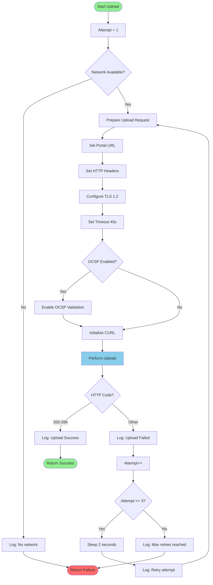
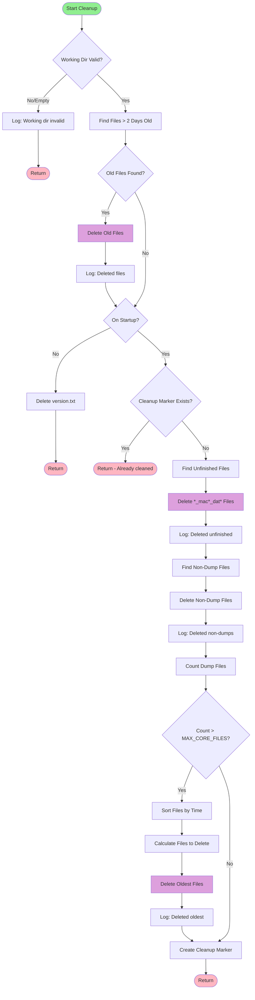

# Flowcharts: uploadDumps.sh Migration

## Main Processing Flow

### Mermaid Diagram



```mermaid
flowchart TD
    Start([Start uploadDumps]) --> ParseArgs[Parse Command Line Arguments]
    ParseArgs --> LoadConfig[Load Configuration Files]
    LoadConfig --> InitPlatform[Initialize Platform]
    InitPlatform --> AcquireLock{Acquire Lock}
    
    AcquireLock -->|Lock Exists & Exit Mode| LogExit[Log: Another instance running]
    LogExit --> End1([Exit 0])
    
    AcquireLock -->|Lock Exists & Wait Mode| WaitLock[Wait for Lock Release]
    WaitLock --> AcquireLock
    
    AcquireLock -->|Lock Acquired| CreateLock[Create Lock Directory]
    CreateLock --> DeferBoot{Uptime < 480s AND Video Device?}
    
    DeferBoot -->|Yes| SleepDefer[Sleep Until 480s Uptime]
    SleepDefer --> CheckNetwork
    
    DeferBoot -->|No| CheckNetwork{Network Available?}
    
    CheckNetwork -->|Wait for Network| NetworkLoop[Network Check Loop]
    NetworkLoop --> CheckNetwork
    
    CheckNetwork -->|Available| CheckTime{System Time Synced?}
    
    CheckTime -->|Wait for Time| TimeLoop[Time Sync Loop]
    TimeLoop --> CheckTime
    
    CheckTime -->|Synced| CheckMediaClient{DEVICE_TYPE = MEDIACLIENT?}
    
    CheckMediaClient -->|Yes| FetchPrivacy[get_privacy_control_mode via RBUS]
    FetchPrivacy --> CheckPrivacy{Privacy Mode = DO_NOT_SHARE?}
    CheckPrivacy -->|Yes| DoNotSharePath[Scan Dumps, Skip Archiving, Delete Dump Files]
    DoNotSharePath --> ReleaseLock1[Release Lock]
    ReleaseLock1 --> End2([Exit 0])
    
    CheckMediaClient -->|No| Cleanup[Cleanup Old Files]
    CheckPrivacy -->|No| Cleanup
    
    CheckPrivacy -->|No| Cleanup[Cleanup Old Files]
    Cleanup --> ScanDumps[Scan for Dump Files]
    ScanDumps --> CheckDumps{Dumps Found?}
    
    CheckDumps -->|No| LogNoDumps[Log: No dumps found]
    LogNoDumps --> ReleaseLock2[Release Lock]
    ReleaseLock2 --> End3([Exit 0])
    
    CheckDumps -->|Yes| ProcessLoop{More Dumps to Process?}
    
    ProcessLoop -->|Yes| CheckRecovery{Recovery Time Reached?}
    
    CheckRecovery -->|No| ShiftRecovery[Shift Recovery Time]
    ShiftRecovery --> RemoveDumps2[Remove Pending Dumps]
    RemoveDumps2 --> ReleaseLock3[Release Lock]
    ReleaseLock3 --> End4([Exit 0])
    
    CheckRecovery -->|Yes| CheckRateLimit{Upload Limit Exceeded?}
    
    CheckRateLimit -->|Yes| CreateCrashloop[Create Crashloop Marker]
    CreateCrashloop --> UploadCrashloop[Upload Crashloop Dump]
    UploadCrashloop --> SetRecovery[Set Recovery Time]
    SetRecovery --> RemoveDumps2
    
    CheckRateLimit -->|No| ProcessDump[Process Single Dump]
    ProcessDump --> ProcessLoop
    
    ProcessLoop -->|No| ReleaseLock4[Release Lock]
    ReleaseLock4 --> End5([Exit 0])
    
    style Start fill:#90EE90
    style End1 fill:#FFB6C1
    style End2 fill:#FFB6C1
    style End3 fill:#FFB6C1
    style End4 fill:#FFB6C1
    style End5 fill:#FFB6C1
    style ProcessDump fill:#87CEEB
    style CreateLock fill:#FFD700
    style Cleanup fill:#DDA0DD
```

## Process Single Dump Flow

### Mermaid Diagram



```mermaid
flowchart TD
    Start([Start Process Dump]) --> ValidateFile{File Exists & Valid?}
    
    ValidateFile -->|No| LogSkip[Log: Skip invalid file]
    LogSkip --> Return1([Return])
    
    ValidateFile -->|Yes| CheckProcessed{Already Processed?}
    
    CheckProcessed -->|Yes, is .tgz| LogAlready[Log: Already processed]
    LogAlready --> Return2([Return])
    
    CheckProcessed -->|No| SanitizeFilename[Sanitize Filename]
    SanitizeFilename --> CheckContainer{Contains Container Delimiter?}
    
    CheckContainer -->|Yes| ParseContainer[Parse Container Info]
    ParseContainer --> SendTelemetry[Send Container Telemetry]
    SendTelemetry --> GetMetadata
    
    CheckContainer -->|No| GetMetadata[Get File Metadata]
    
    GetMetadata --> GetMtime[Get Modification Time]
    GetMtime --> CheckZeroSize{File Size = 0?}
    
    CheckZeroSize -->|Yes| LogZeroSize[Log & Send Zero-Size Telemetry]
    LogZeroSize --> GenerateArchiveName
    
    CheckZeroSize -->|No| GenerateArchiveName[Generate Archive Name]
    
    GenerateArchiveName --> AddMetadata[Add SHA1, MAC, Date, Box, Model]
    AddMetadata --> CheckLength{Filename Length >= 135?}
    
    CheckLength -->|Yes| RemovePrefix[Remove SHA1 Prefix]
    RemovePrefix --> CheckLength2{Still >= 135?}
    
    CheckLength2 -->|Yes| TruncateProcess[Truncate Process Name to 20 chars]
    TruncateProcess --> CollectFiles
    
    CheckLength2 -->|No| CollectFiles[Collect Files for Archive]
    CheckLength -->|No| CollectFiles
    
    CollectFiles --> AddDumpFile[Add Dump File]
    AddDumpFile --> AddVersion[Add version.txt]
    AddVersion --> AddCoreLog[Add core_log.txt]
    AddCoreLog --> CheckDumpType{Dump Type?}
    
    CheckDumpType -->|Minidump| GetLogFiles[Get Process Log Files]
    GetLogFiles --> AddLogFiles[Add Log Files to Archive]
    AddLogFiles --> CheckTmpUsage
    
    CheckDumpType -->|Coredump| CheckTmpUsage{/tmp Usage > 70%?}
    
    CheckTmpUsage -->|Yes| CompressDirect[Compress Directly]
    CompressDirect --> CheckCompression1{Compression Success?}
    
    CheckTmpUsage -->|No| CreateTempDir[Create Temp Directory in /tmp]
    CreateTempDir --> CopyToTemp[Copy Files to Temp]
    CopyToTemp --> CompressFromTemp[Compress from /tmp]
    CompressFromTemp --> CheckCompression2{Compression Success?}
    
    CheckCompression1 -->|No| SendFailTelemetry[Send Compression Fail Telemetry]
    SendFailTelemetry --> TryTempFallback[Try /tmp Fallback]
    TryTempFallback --> CheckCompression2
    
    CheckCompression2 -->|No| LogCompressionFail[Log: Compression Failed]
    LogCompressionFail --> CleanupTemp[Cleanup Temp Files]
    CleanupTemp --> Return3([Return Error])
    
    CheckCompression1 -->|Yes| RemoveOriginal[Remove Original Dump]
    CheckCompression2 -->|Yes| RemoveOriginal
    
    RemoveOriginal --> CheckBoxReboot{Box Rebooting?}
    
    CheckBoxReboot -->|Yes| LogRebootSkip[Log: Skip upload, box rebooting]
    LogRebootSkip --> CleanupTemp
    
    CheckBoxReboot -->|No| StartUpload[Start Upload Process]
    StartUpload --> UploadWithRetry[Upload with Retry 3x]
    UploadWithRetry --> CheckUpload{Upload Success?}
    
    CheckUpload -->|Yes| RecordTimestamp[Record Upload Timestamp]
    RecordTimestamp --> RemoveArchive[Remove Archive File]
    RemoveArchive --> LogSuccess[Log: Upload Success]
    LogSuccess --> SendUploadTelemetry[Send Upload Success Telemetry]
    SendUploadTelemetry --> CleanupTemp2[Cleanup Temp Files]
    CleanupTemp2 --> Return4([Return Success])
    
    CheckUpload -->|No & Minidump| SaveDump[Save Dump for Later]
    SaveDump --> CheckDumpCount{Dump Count > 5?}
    
    CheckDumpCount -->|Yes| RemoveOldest[Remove Oldest Dumps]
    RemoveOldest --> CleanupTemp3[Cleanup Temp Files]
    CleanupTemp3 --> Return5([Return Error])
    
    CheckDumpCount -->|No| CleanupTemp3
    
    CheckUpload -->|No & Coredump| RemoveFailedArchive[Remove Failed Archive]
    RemoveFailedArchive --> LogUploadFail[Log: Upload Failed]
    LogUploadFail --> CleanupTemp4[Cleanup Temp Files]
    CleanupTemp4 --> Return6([Return Error])
    
    style Start fill:#90EE90
    style Return1 fill:#FFB6C1
    style Return2 fill:#FFB6C1
    style Return3 fill:#FF6B6B
    style Return4 fill:#90EE90
    style Return5 fill:#FF6B6B
    style Return6 fill:#FF6B6B
    style UploadWithRetry fill:#87CEEB
    style CompressDirect fill:#FFD700
    style CompressFromTemp fill:#FFD700
```

## Upload with Retry Flow

### Mermaid Diagram



## Cleanup Operations Flow

### Mermaid Diagram



## Text-Based Flowchart Alternative

For environments with Mermaid rendering issues:

### Main Processing Flow (Text)

```
START
  |
  v
Parse Command Line Arguments
  |
  v
Load Configuration Files (device.properties, include.properties)
  |
  v
Initialize Platform (device type, MAC, model, SHA1)
  |
  v
[Acquire Lock?]
  |
  +--[Lock Exists & Exit Mode]--> Log error --> EXIT(0)
  |
  +--[Lock Exists & Wait Mode]--> Wait 2s --> [Acquire Lock?]
  |
  +--[Lock Acquired]--> Create Lock Directory
                          |
                          v
                       [Video Device & Uptime < 480s?]
                          |
                          +--[Yes]--> Sleep until 480s uptime
                          |                |
                          +--[No]----------+
                                          |
                                          v
                                       [Network Available?]
                                          |
                                          +--[No]--> Wait & retry (18x 10s)
                                          |
                                          +--[Yes]--> [System Time Synced?]
                                                        |
                                                        +--[No]--> Wait & retry (10x 1s)
                                                        |
                                                        +--[Yes]--> [Telemetry Opt-Out?]
                                                                      |
                                                                      +--[Yes]--> Remove all dumps --> Release lock --> EXIT(0)
                                                                      |
                                                                      +--[No]--> [Privacy Mode = DO_NOT_SHARE?]
                                                                                  |
                                                                                  +--[Yes]--> Remove all dumps --> Release lock --> EXIT(0)
                                                                                  |
                                                                                  +--[No]--> Cleanup old files
                                                                                              |
                                                                                              v
                                                                                           Scan for dump files
                                                                                              |
                                                                                              v
                                                                                           [Dumps found?]
                                                                                              |
                                                                                              +--[No]--> Log message --> Release lock --> EXIT(0)
                                                                                              |
                                                                                              +--[Yes]--> WHILE (more dumps)
                                                                                                            |
                                                                                                            v
                                                                                                         [Recovery time reached?]
                                                                                                            |
                                                                                                            +--[No]--> Shift recovery --> Remove dumps --> EXIT(0)
                                                                                                            |
                                                                                                            +--[Yes]--> [Upload limit exceeded?]
                                                                                                                          |
                                                                                                                          +--[Yes]--> Create crashloop --> Upload --> Set recovery --> Remove dumps --> EXIT(0)
                                                                                                                          |
                                                                                                                          +--[No]--> Process dump
                                                                                                                                        |
                                                                                                                                        v
                                                                                                                                     [Continue loop]
                                                                                                            |
                                                                                                            v
                                                                                                         END WHILE
                                                                                                            |
                                                                                                            v
                                                                                                         Release lock
                                                                                                            |
                                                                                                            v
                                                                                                         EXIT(0)
```

### Process Single Dump Flow (Text)

```
START Process Dump
  |
  v
[File exists & valid?]
  |
  +--[No]--> Log skip --> RETURN
  |
  +--[Yes]--> [Already processed (.tgz)?]
                |
                +--[Yes]--> Log already processed --> RETURN
                |
                +--[No]--> Sanitize filename
                            |
                            v
                         [Contains container delimiter <#=#>?]
                            |
                            +--[Yes]--> Parse container info --> Send telemetry
                            |                                        |
                            +--[No]----------------------------------+
                                                                     |
                                                                     v
                                                                  Get file metadata
                                                                     |
                                                                     v
                                                                  Get modification time
                                                                     |
                                                                     v
                                                                  [File size = 0?]
                                                                     |
                                                                     +--[Yes]--> Log & send telemetry
                                                                     |                |
                                                                     +--[No]----------+
                                                                                      |
                                                                                      v
                                                                                   Generate archive name (SHA1_macMAC_datDATE_boxTYPE_modMODEL_filename)
                                                                                      |
                                                                                      v
                                                                                   [Filename length >= 135?]
                                                                                      |
                                                                                      +--[Yes]--> Remove SHA1 prefix
                                                                                      |              |
                                                                                      |              v
                                                                                      |           [Still >= 135?]
                                                                                      |              |
                                                                                      |              +--[Yes]--> Truncate process name to 20 chars
                                                                                      |              |
                                                                                      +--[No]--------+
                                                                                                     |
                                                                                                     v
                                                                                                  Collect files for archive
                                                                                                     |
                                                                                                     v
                                                                                                  Add dump file, version.txt, core_log.txt
                                                                                                     |
                                                                                                     v
                                                                                                  [Dump type = minidump?]
                                                                                                     |
                                                                                                     +--[Yes]--> Get & add process log files
                                                                                                     |                |
                                                                                                     +--[No]----------+
                                                                                                                      |
                                                                                                                      v
                                                                                                                   [/tmp usage > 70%?]
                                                                                                                      |
                                                                                                                      +--[Yes]--> Compress directly
                                                                                                                      |              |
                                                                                                                      +--[No]--> Create temp dir --> Copy files --> Compress
                                                                                                                                    |
                                                                                                                                    v
                                                                                                                                 [Compression success?]
                                                                                                                                    |
                                                                                                                                    +--[No]--> Send telemetry --> Try /tmp fallback
                                                                                                                                    |                                  |
                                                                                                                                    +--[Yes]----------------------------+
                                                                                                                                                                       |
                                                                                                                                                                       v
                                                                                                                                                                    Remove original dump
                                                                                                                                                                       |
                                                                                                                                                                       v
                                                                                                                                                                    [Box rebooting?]
                                                                                                                                                                       |
                                                                                                                                                                       +--[Yes]--> Log skip --> Cleanup --> RETURN
                                                                                                                                                                       |
                                                                                                                                                                       +--[No]--> Upload with retry (3 attempts, 45s timeout each)
                                                                                                                                                                                    |
                                                                                                                                                                                    v
                                                                                                                                                                                 [Upload success?]
                                                                                                                                                                                    |
                                                                                                                                                                                    +--[Yes]--> Record timestamp --> Remove archive --> Send telemetry --> RETURN(success)
                                                                                                                                                                                    |
                                                                                                                                                                                    +--[No & minidump]--> Save dump --> [Count > 5?] --> Remove oldest if yes --> RETURN(error)
                                                                                                                                                                                    |
                                                                                                                                                                                    +--[No & coredump]--> Remove archive --> Log error --> RETURN(error)
```

## Summary of Flowchart Components

### Key Decision Points:
1. **Lock Acquisition**: Single instance enforcement
2. **Network & Time Checks**: Prerequisites for upload
3. **Privacy Checks**: Opt-out and privacy mode
4. **Rate Limiting**: Prevent upload flooding
5. **File Processing**: Container info, metadata, compression
6. **Upload Retry**: 3 attempts with 45s timeout each
7. **Cleanup**: Remove old and processed files

### Critical Paths:
1. **Normal Upload**: Scan → Process → Compress → Upload → Success
2. **Rate Limited**: Detect limit → Create crashloop marker → Set recovery
3. **Network Unavailable**: Detect → Save for later → Exit
4. **Upload Failure**: Retry 3x → Save (minidump) or Remove (coredump)

### Error Handling:
- All decision points have error branches
- Cleanup always performed before exit
- Locks always released on exit
- Telemetry sent for important events
