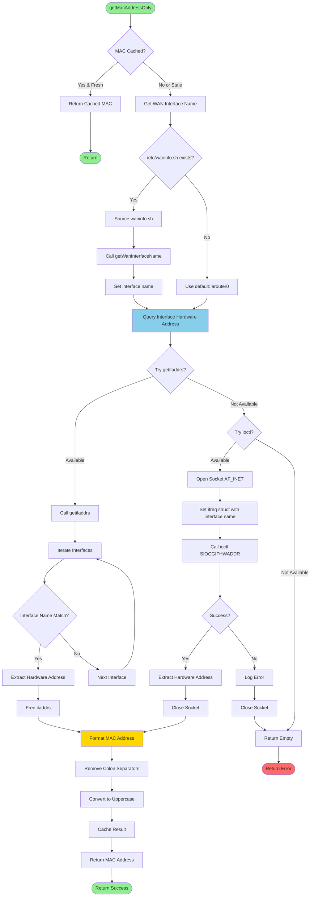
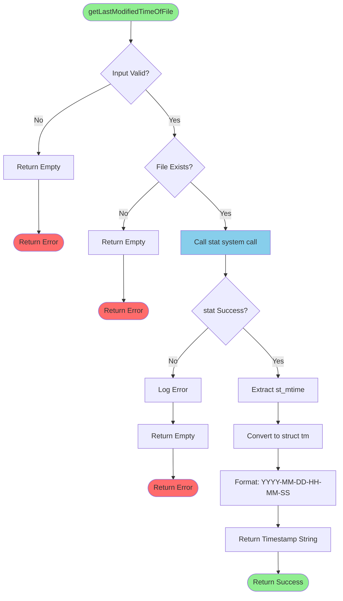
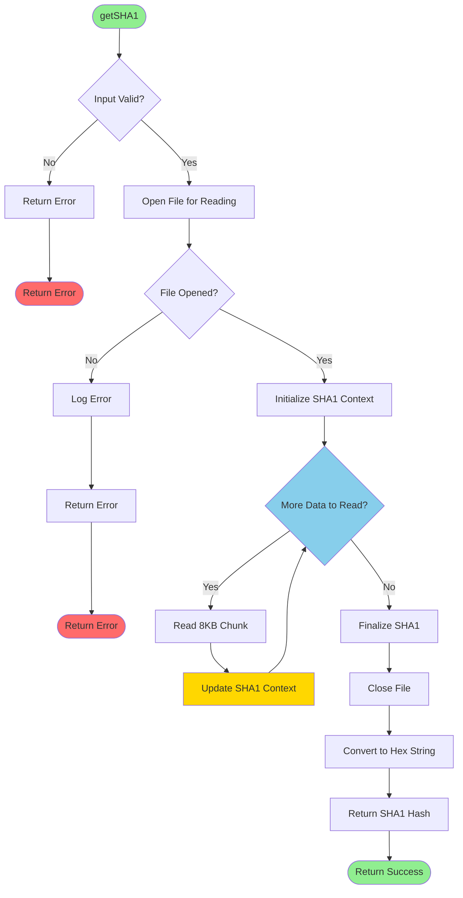
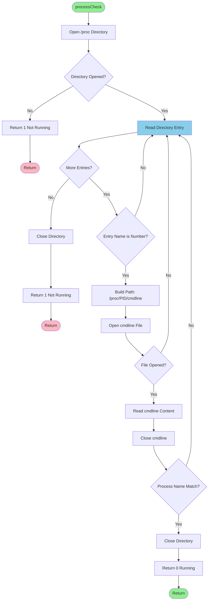
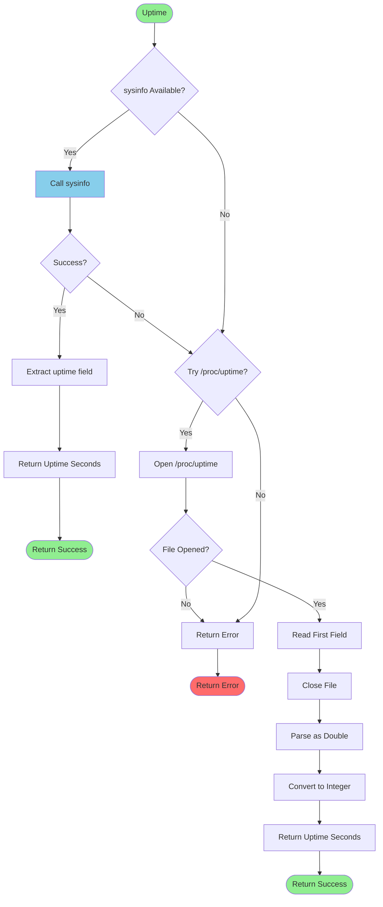
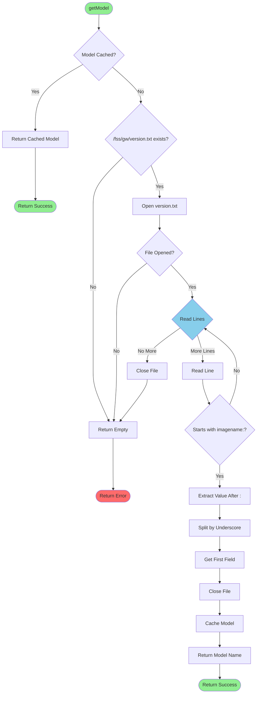
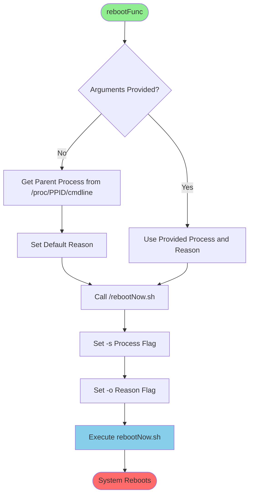

# Flowcharts: uploadDumpsUtils.sh Migration

## Get MAC Address Flow

### Mermaid Diagram



## Get File Modification Time Flow

### Mermaid Diagram



## Get SHA1 Checksum Flow

### Mermaid Diagram



## Process Check Flow

### Mermaid Diagram



## Get System Uptime Flow

### Mermaid Diagram



## Get Device Model Flow

### Mermaid Diagram



## Reboot Function Flow

### Mermaid Diagram



## Text-Based Flowchart Alternative

For environments with Mermaid rendering issues:

### Get MAC Address Flow (Text)

```
START getMacAddressOnly()
  |
  v
[MAC cached & fresh?]
  |
  +--[Yes]--> Return cached MAC --> RETURN(success)
  |
  +--[No]--> Get WAN interface name
              |
              v
           [/etc/waninfo.sh exists?]
              |
              +--[Yes]--> Source script --> Call getWanInterfaceName() --> Set interface
              |                                                                |
              +--[No]--> Use default interface (erouter0)--------------------+
                                                                              |
                                                                              v
                                                                           Query interface hardware address
                                                                              |
                                                                              v
                                                                           [getifaddrs() available?]
                                                                              |
                                                                              +--[Yes]--> Call getifaddrs()
                                                                              |             |
                                                                              |             v
                                                                              |          Iterate interfaces
                                                                              |             |
                                                                              |             v
                                                                              |          [Interface name match?]
                                                                              |             |
                                                                              |             +--[Yes]--> Extract hwaddr --> Free ifaddrs
                                                                              |             |                                |
                                                                              |             +--[No]--> Next interface ------+
                                                                              |                                             |
                                                                              +--[No]--> [ioctl() available?]              |
                                                                                           |                               |
                                                                                           +--[Yes]--> Open socket        |
                                                                                           |             |                |
                                                                                           |             v                |
                                                                                           |          Set ifreq struct    |
                                                                                           |             |                |
                                                                                           |             v                |
                                                                                           |          Call ioctl()        |
                                                                                           |             |                |
                                                                                           |             v                |
                                                                                           |          [Success?]          |
                                                                                           |             |                |
                                                                                           |             +--[Yes]--> Extract hwaddr --> Close socket
                                                                                           |             |                               |
                                                                                           |             +--[No]--> Log error --> Close socket --> RETURN(error)
                                                                                           |                                             |
                                                                                           +--[No]--> RETURN(error)                    |
                                                                                                                                       |
                                                                                                                                       v
                                                                                                                                    Format MAC address
                                                                                                                                       |
                                                                                                                                       v
                                                                                                                                    Remove colons
                                                                                                                                       |
                                                                                                                                       v
                                                                                                                                    Convert to uppercase
                                                                                                                                       |
                                                                                                                                       v
                                                                                                                                    Cache result
                                                                                                                                       |
                                                                                                                                       v
                                                                                                                                    RETURN(MAC address)
```

### Get File Modification Time Flow (Text)

```
START getLastModifiedTimeOfFile(filepath)
  |
  v
[Input valid?]
  |
  +--[No]--> RETURN(empty)
  |
  +--[Yes]--> [File exists?]
                |
                +--[No]--> RETURN(empty)
                |
                +--[Yes]--> Call stat(filepath)
                              |
                              v
                           [stat() success?]
                              |
                              +--[No]--> Log error --> RETURN(empty)
                              |
                              +--[Yes]--> Extract st_mtime
                                            |
                                            v
                                         Convert time_t to struct tm
                                            |
                                            v
                                         Format: YYYY-MM-DD-HH-MM-SS
                                            |
                                            v
                                         RETURN(timestamp string)
```

### Get SHA1 Checksum Flow (Text)

```
START getSHA1(filepath)
  |
  v
[Input valid?]
  |
  +--[No]--> RETURN(error)
  |
  +--[Yes]--> Open file for reading
                |
                v
             [File opened?]
                |
                +--[No]--> Log error --> RETURN(error)
                |
                +--[Yes]--> Initialize SHA1 context
                              |
                              v
                           WHILE (data available)
                              |
                              v
                           Read 8KB chunk
                              |
                              v
                           Update SHA1 context
                              |
                              v
                           END WHILE
                              |
                              v
                           Finalize SHA1
                              |
                              v
                           Close file
                              |
                              v
                           Convert digest to hex string
                              |
                              v
                           RETURN(SHA1 hash)
```

### Process Check Flow (Text)

```
START processCheck(process_name)
  |
  v
Open /proc directory
  |
  v
[Directory opened?]
  |
  +--[No]--> RETURN(1 - not running)
  |
  +--[Yes]--> WHILE (read directory entry)
                |
                v
             [Entry is numeric (PID)?]
                |
                +--[No]--> Continue to next entry
                |
                +--[Yes]--> Build path: /proc/PID/cmdline
                              |
                              v
                           Open cmdline file
                              |
                              v
                           [File opened?]
                              |
                              +--[No]--> Continue to next entry
                              |
                              +--[Yes]--> Read cmdline content
                                            |
                                            v
                                         Close cmdline
                                            |
                                            v
                                         [Process name matches?]
                                            |
                                            +--[No]--> Continue to next entry
                                            |
                                            +--[Yes]--> Close directory
                                                          |
                                                          v
                                                       RETURN(0 - running)
              |
              v
           END WHILE
              |
              v
           Close directory
              |
              v
           RETURN(1 - not running)
```

### Get System Uptime Flow (Text)

```
START Uptime()
  |
  v
[sysinfo() available?]
  |
  +--[Yes]--> Call sysinfo()
  |             |
  |             v
  |          [Success?]
  |             |
  |             +--[Yes]--> Extract uptime field --> RETURN(uptime)
  |             |
  |             +--[No]-----+
  |                         |
  +--[No]-----------------+
                          |
                          v
                       [Try /proc/uptime?]
                          |
                          +--[Yes]--> Open /proc/uptime
                          |             |
                          |             v
                          |          [File opened?]
                          |             |
                          |             +--[No]--> RETURN(error)
                          |             |
                          |             +--[Yes]--> Read first field
                          |                           |
                          |                           v
                          |                        Close file
                          |                           |
                          |                           v
                          |                        Parse as double
                          |                           |
                          |                           v
                          |                        Convert to integer
                          |                           |
                          |                           v
                          |                        RETURN(uptime)
                          |
                          +--[No]--> RETURN(error)
```

### Get Device Model Flow (Text)

```
START getModel()
  |
  v
[Model cached?]
  |
  +--[Yes]--> RETURN(cached model)
  |
  +--[No]--> [/fss/gw/version.txt exists?]
              |
              +--[No]--> RETURN(empty)
              |
              +--[Yes]--> Open version.txt
                            |
                            v
                         [File opened?]
                            |
                            +--[No]--> RETURN(empty)
                            |
                            +--[Yes]--> WHILE (read lines)
                                          |
                                          v
                                       [Line starts with "imagename:"?]
                                          |
                                          +--[No]--> Continue to next line
                                          |
                                          +--[Yes]--> Extract value after ":"
                                                        |
                                                        v
                                                     Split by underscore "_"
                                                        |
                                                        v
                                                     Get first field
                                                        |
                                                        v
                                                     Close file
                                                        |
                                                        v
                                                     Cache model
                                                        |
                                                        v
                                                     RETURN(model name)
                                        |
                                        v
                                     END WHILE
                                        |
                                        v
                                     Close file
                                        |
                                        v
                                     RETURN(empty)
```

### Reboot Function Flow (Text)

```
START rebootFunc(process_name, reason)
  |
  v
[Arguments provided?]
  |
  +--[No]--> Get parent process from /proc/$PPID/cmdline
  |            |
  |            v
  |         Set default reason message
  |            |
  +--[Yes]-----+
               |
               v
            Call /rebootNow.sh with:
              -s process_name
              -o reason
               |
               v
            Execute script
               |
               v
            SYSTEM REBOOTS
```

## Summary of Utility Functions

### Network Functions:
1. **getMacAddressOnly**: Get MAC without colons
2. **getIPAddress**: Get IPv4 address of interface
3. **getMacAddress**: Get MAC with colons (CM interface)
4. **getErouterMacAddress**: Get eRouter MAC with colons

### System Information Functions:
5. **Uptime**: Get system uptime in seconds
6. **getModel**: Get device model from version file
7. **processCheck**: Check if process is running
8. **Timestamp**: Get current timestamp

### File Functions:
9. **getLastModifiedTimeOfFile**: Get file mtime formatted
10. **getSHA1**: Calculate SHA1 checksum of file

### Control Functions:
11. **rebootFunc**: Initiate system reboot with logging

### Performance Characteristics:
- **Cached operations**: < 1ms (MAC, model)
- **File operations**: 1-10ms (stat, small files)
- **Network queries**: 5-20ms (interface info)
- **SHA1 calculation**: ~100ms per MB
- **Process check**: 20-100ms (depends on process count)
