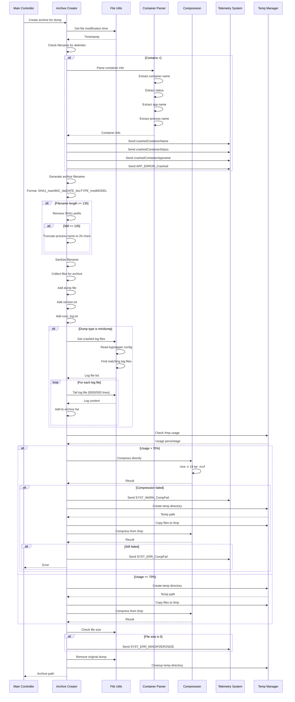
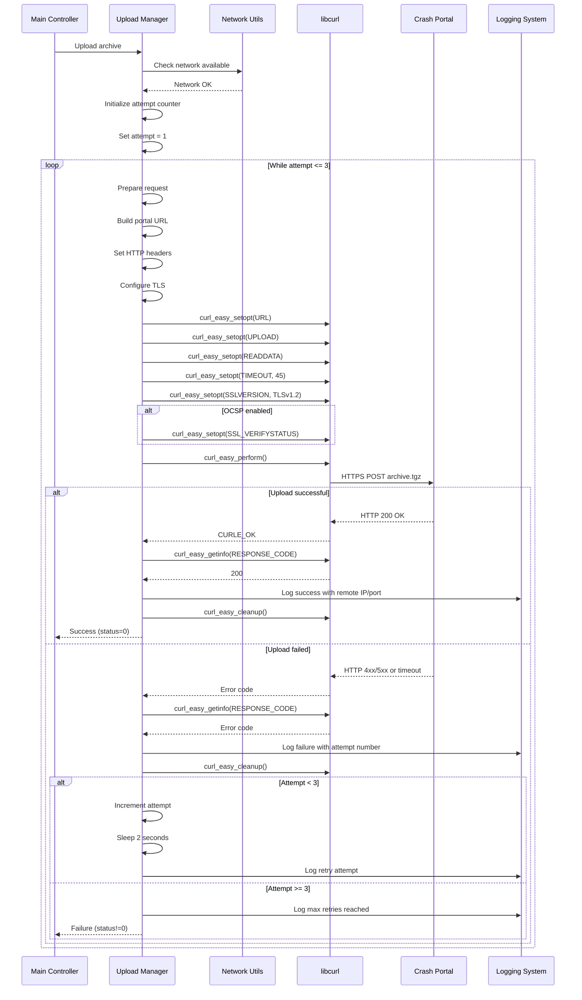
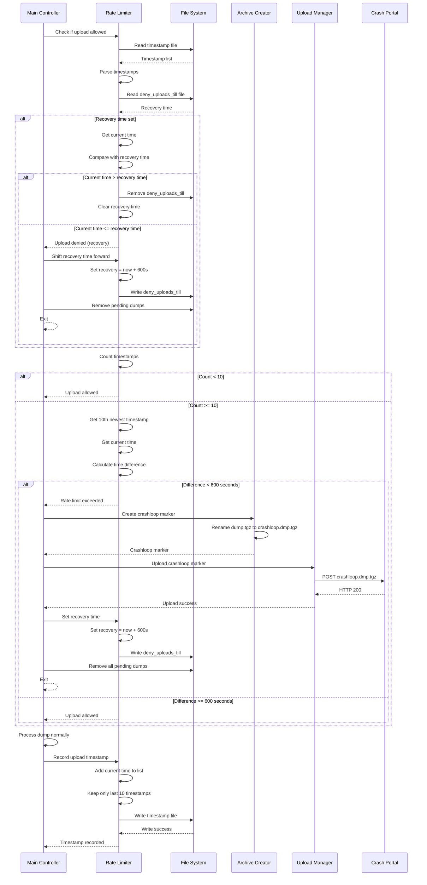
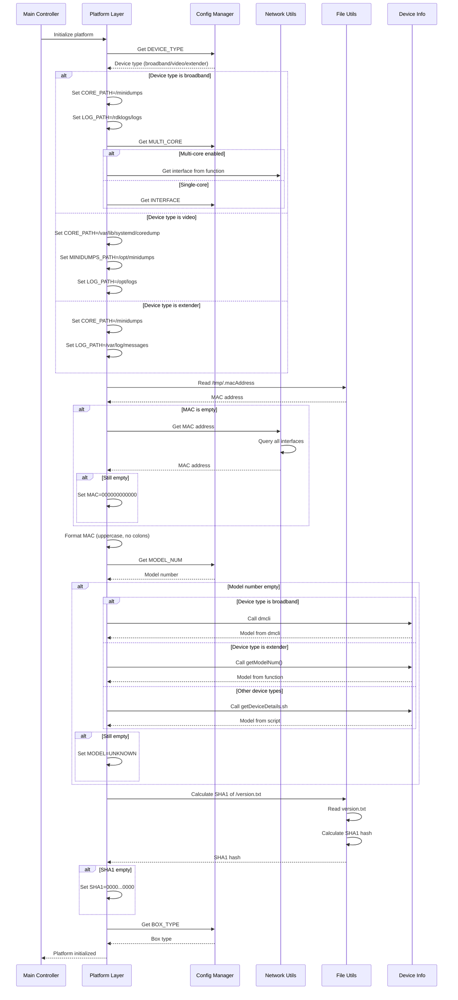

# Sequence Diagrams: uploadDumps.sh Migration

## Complete Dump Upload Sequence

### Mermaid Diagram



```mermaid
sequenceDiagram
    participant User
    participant Main as Main Controller
    participant Config as Config Manager
    participant Platform as Platform Layer
    participant Lock as Lock Manager
    participant Network as Network Utils
    participant Scanner as File Scanner
    participant Archive as Archive Creator
    participant RateLimit as Rate Limiter
    participant Upload as Upload Manager
    participant Portal as Crash Portal
    participant Log as Logging System
    
    User->>Main: Start uploadDumps
    Main->>Config: Load configuration
    Config->>Config: Read device.properties
    Config->>Config: Read include.properties
    Config->>Config: Load environment vars
    Config-->>Main: Configuration loaded
    
    Main->>Platform: Initialize platform
    Platform->>Platform: Detect device type
    Platform->>Platform: Get MAC address
    Platform->>Platform: Get model & SHA1
    Platform-->>Main: Platform initialized
    
    Main->>Lock: Acquire lock
    Lock->>Lock: Check lock exists
    alt Lock exists & exit mode
        Lock-->>Main: Lock failed
        Main->>Log: Log error
        Main->>User: Exit(0)
    else Lock exists & wait mode
        Lock->>Lock: Wait 2 seconds
        Lock->>Lock: Retry acquire
    else Lock acquired
        Lock->>Lock: Create lock directory
        Lock-->>Main: Lock acquired
    end
    
    Main->>Network: Wait for network
    Network->>Network: Check route available
    loop Until available or timeout
        Network->>Network: Sleep & retry
    end
    Network-->>Main: Network ready
    
    Main->>Network: Wait for system time
    Network->>Network: Check stt_received flag
    Network-->>Main: Time synced
    
    Main->>Scanner: Scan for dumps
    Scanner->>Scanner: Find *.dmp or *_core*.gz
    Scanner->>Scanner: Filter processed files
    Scanner-->>Main: Dump list
    
    loop For each dump
        Main->>RateLimit: Check rate limit
        RateLimit->>RateLimit: Load timestamps
        RateLimit->>RateLimit: Check recovery time
        
        alt Recovery time not reached
            RateLimit-->>Main: Upload denied
            Main->>RateLimit: Shift recovery time
            Main->>Scanner: Remove pending dumps
            Main->>Lock: Release lock
            Main->>User: Exit(0)
        end
        
        RateLimit->>RateLimit: Check 10 uploads in 10 min
        
        alt Rate limit exceeded
            RateLimit-->>Main: Limit exceeded
            Main->>Archive: Create crashloop marker
            Archive-->>Main: Marker created
            Main->>Upload: Upload crashloop
            Upload->>Portal: POST crashloop.tgz
            Portal-->>Upload: HTTP 200
            Upload-->>Main: Upload success
            Main->>RateLimit: Set recovery time
            Main->>Scanner: Remove pending dumps
            Main->>Lock: Release lock
            Main->>User: Exit(0)
        else Rate limit OK
            RateLimit-->>Main: Upload allowed
            
            Main->>Archive: Create archive
            Archive->>Archive: Generate filename
            Archive->>Archive: Parse container info (if present)
            Archive->>Log: Send telemetry
            Archive->>Archive: Collect log files
            Archive->>Archive: Create tar.gz
            
            alt Compression fails
                Archive->>Archive: Try /tmp fallback
                Archive->>Log: Send failure telemetry
            end
            
            Archive-->>Main: Archive created
            
            Main->>Upload: Upload archive
            Upload->>Upload: Prepare HTTPS request
            Upload->>Upload: Set TLS 1.2
            Upload->>Upload: Set timeout 45s
            
            loop Retry up to 3 times
                Upload->>Portal: POST archive.tgz
                
                alt Upload success
                    Portal-->>Upload: HTTP 200
                    Upload-->>Main: Success
                    Main->>RateLimit: Record timestamp
                    Main->>Archive: Remove archive
                    Main->>Log: Log success
                    Main->>Log: Send upload telemetry
                else Upload fails
                    Portal-->>Upload: HTTP error
                    Upload->>Upload: Wait 2 seconds
                    Upload->>Upload: Retry
                end
            end
            
            alt All retries failed
                Upload-->>Main: Upload failed
                alt Dump is minidump
                    Main->>Archive: Save dump locally
                    Main->>Log: Log save
                else Dump is coredump
                    Main->>Archive: Remove archive
                    Main->>Log: Log failure
                end
            end
        end
    end
    
    Main->>Lock: Release lock
    Main->>User: Exit(0)
```

## Archive Creation Sequence

### Mermaid Diagram



## Upload with Retry Sequence

### Mermaid Diagram



## Rate Limiting Sequence

### Mermaid Diagram



## Platform Initialization Sequence

### Mermaid Diagram



## Text-Based Sequence Diagram Alternative

### Complete Dump Upload Sequence (Text)

```
User -> Main: Start uploadDumps

Main -> Config: Load configuration
Config -> Config: Read device.properties
Config -> Config: Read include.properties  
Config -> Config: Load environment
Config -> Main: Configuration loaded

Main -> Platform: Initialize platform
Platform -> Platform: Detect device type
Platform -> Platform: Get MAC address
Platform -> Platform: Get model & SHA1
Platform -> Main: Platform initialized

Main -> Lock: Acquire lock
Lock -> Lock: Check lock exists

IF lock exists AND exit mode:
    Lock -> Main: Lock failed
    Main -> Log: Log error
    Main -> User: Exit(0)

IF lock exists AND wait mode:
    Lock -> Lock: Wait 2 seconds
    Lock -> Lock: Retry acquire

IF lock acquired:
    Lock -> Lock: Create lock directory
    Lock -> Main: Lock acquired

Main -> Network: Wait for network
Network -> Network: Check route available
LOOP until available or timeout:
    Network -> Network: Sleep & retry
Network -> Main: Network ready

Main -> Network: Wait for system time
Network -> Network: Check stt_received flag
Network -> Main: Time synced

Main -> Scanner: Scan for dumps
Scanner -> Scanner: Find dumps
Scanner -> Scanner: Filter processed
Scanner -> Main: Dump list

LOOP for each dump:
    Main -> RateLimit: Check rate limit
    RateLimit -> RateLimit: Load timestamps
    RateLimit -> RateLimit: Check recovery time
    
    IF recovery time not reached:
        RateLimit -> Main: Upload denied
        Main -> RateLimit: Shift recovery time
        Main -> Scanner: Remove pending dumps
        Main -> Lock: Release lock
        Main -> User: Exit(0)
    
    RateLimit -> RateLimit: Check 10 in 10 min
    
    IF rate limit exceeded:
        RateLimit -> Main: Limit exceeded
        Main -> Archive: Create crashloop marker
        Archive -> Main: Marker created
        Main -> Upload: Upload crashloop
        Upload -> Portal: POST crashloop.tgz
        Portal -> Upload: HTTP 200
        Upload -> Main: Upload success
        Main -> RateLimit: Set recovery time
        Main -> Scanner: Remove pending dumps
        Main -> Lock: Release lock
        Main -> User: Exit(0)
    
    IF rate limit OK:
        RateLimit -> Main: Upload allowed
        
        Main -> Archive: Create archive
        Archive -> Archive: Generate filename
        Archive -> Archive: Parse container info
        Archive -> Log: Send telemetry
        Archive -> Archive: Collect log files
        Archive -> Archive: Create tar.gz
        
        IF compression fails:
            Archive -> Archive: Try /tmp fallback
            Archive -> Log: Send failure telemetry
        
        Archive -> Main: Archive created
        
        Main -> Upload: Upload archive
        Upload -> Upload: Prepare HTTPS request
        Upload -> Upload: Set TLS 1.2
        Upload -> Upload: Set timeout 45s
        
        LOOP retry up to 3 times:
            Upload -> Portal: POST archive.tgz
            
            IF upload success:
                Portal -> Upload: HTTP 200
                Upload -> Main: Success
                Main -> RateLimit: Record timestamp
                Main -> Archive: Remove archive
                Main -> Log: Log success
                Main -> Log: Send upload telemetry
                BREAK
            
            IF upload fails:
                Portal -> Upload: HTTP error
                Upload -> Upload: Wait 2 seconds
                Upload -> Upload: Retry
        
        IF all retries failed:
            Upload -> Main: Upload failed
            
            IF dump is minidump:
                Main -> Archive: Save dump locally
                Main -> Log: Log save
            ELSE (coredump):
                Main -> Archive: Remove archive
                Main -> Log: Log failure

Main -> Lock: Release lock
Main -> User: Exit(0)
```

### Archive Creation Sequence (Text)

```
Main -> Archive: Create archive for dump

Archive -> File: Get file modification time
File -> Archive: Timestamp

Archive -> Archive: Check filename for delimiter

IF contains <#=#> delimiter:
    Archive -> Container: Parse container info
    Container -> Container: Extract container name, status, app, process
    Container -> Archive: Container info
    Archive -> Telemetry: Send container telemetry events

Archive -> Archive: Generate archive filename
Archive -> Archive: Format: SHA1_macMAC_datDATE_boxTYPE_modMODEL

IF filename length >= 135:
    Archive -> Archive: Remove SHA1 prefix
    IF still >= 135:
        Archive -> Archive: Truncate process name to 20 chars

Archive -> Archive: Sanitize filename
Archive -> Archive: Collect files for archive
Archive -> Archive: Add dump file
Archive -> Archive: Add version.txt
Archive -> Archive: Add core_log.txt

IF dump type is minidump:
    Archive -> File: Get crashed log files
    File -> File: Read logmapper config
    File -> File: Find matching log files
    File -> Archive: Log file list
    
    LOOP for each log file:
        Archive -> File: Tail log file (5000/500 lines)
        File -> Archive: Log content
        Archive -> Archive: Add to archive list

Archive -> TmpMgr: Check /tmp usage
TmpMgr -> Archive: Usage percentage

IF usage > 70%:
    Archive -> Compress: Compress directly
    Compress -> Compress: nice -n 19 tar -zcvf
    Compress -> Archive: Result
    
    IF compression failed:
        Archive -> Telemetry: Send SYST_WARN_CompFail
        Archive -> TmpMgr: Create temp directory
        TmpMgr -> Archive: Temp path
        Archive -> TmpMgr: Copy files to /tmp
        Archive -> Compress: Compress from /tmp
        Compress -> Archive: Result
        
        IF still failed:
            Archive -> Telemetry: Send SYST_ERR_CompFail
            Archive -> Main: Error
ELSE (usage <= 70%):
    Archive -> TmpMgr: Create temp directory
    TmpMgr -> Archive: Temp path
    Archive -> TmpMgr: Copy files to /tmp
    Archive -> Compress: Compress from /tmp
    Compress -> Archive: Result

Archive -> File: Check file size

IF file size is 0:
    Archive -> Telemetry: Send SYST_ERR_MINIDPZEROSIZE

Archive -> File: Remove original dump
Archive -> TmpMgr: Cleanup temp directory
Archive -> Main: Archive path
```

## Summary of Interactions

### Key Sequences:
1. **Initialization**: Config → Platform → Lock → Network → Scanner
2. **Rate Limiting**: RateLimit checks → Crashloop creation → Recovery time
3. **Archive Creation**: Container parsing → File collection → Compression → Cleanup
4. **Upload**: Retry loop → HTTPS/TLS → Telemetry → Cleanup
5. **Cleanup**: Timestamp recording → File removal → Lock release

### Component Communication Patterns:
- **Synchronous calls**: Most interactions are synchronous request-response
- **Retry patterns**: Upload (3x), Network wait (18x), Time sync (10x)
- **Event-driven**: Telemetry events sent asynchronously
- **File-based locking**: Lock manager uses filesystem for synchronization
- **State persistence**: Timestamps and recovery time stored in files

### Error Handling Paths:
- Lock acquisition failure → Exit
- Network unavailable → Save dump, exit
- Rate limit exceeded → Crashloop marker, exit
- Upload failure → Retry 3x, then save (minidump) or remove (coredump)
- Compression failure → Fallback to /tmp, retry
