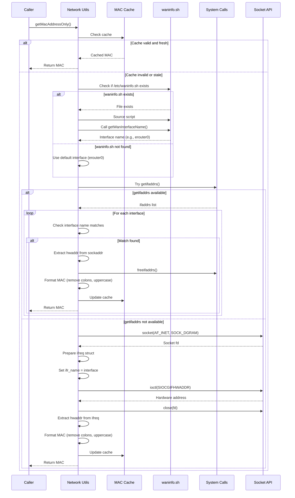
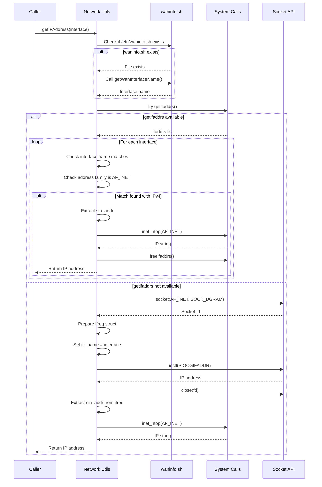
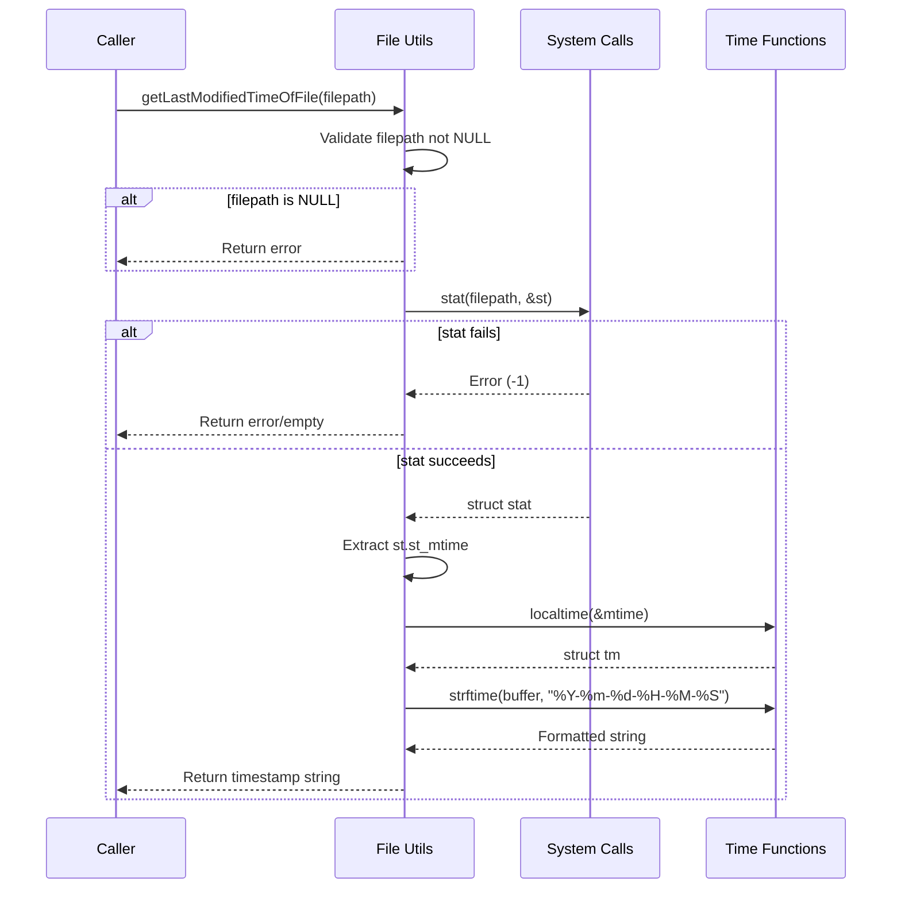
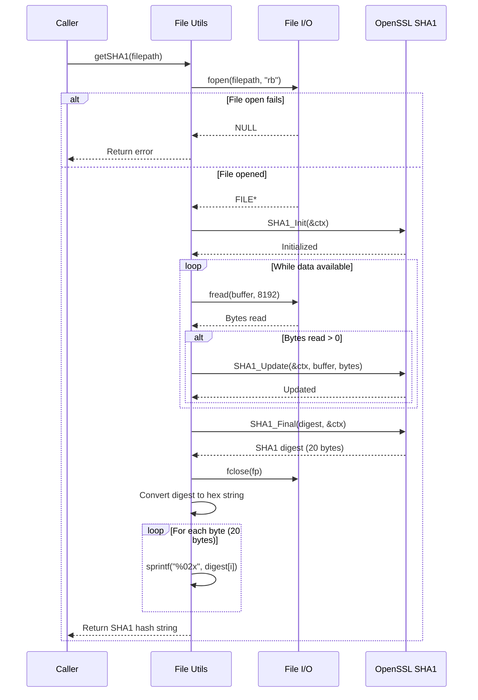
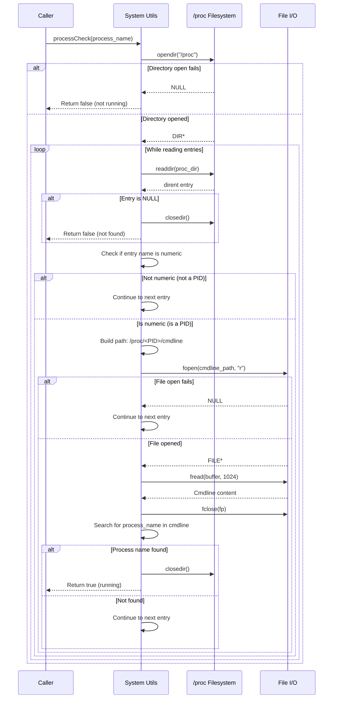
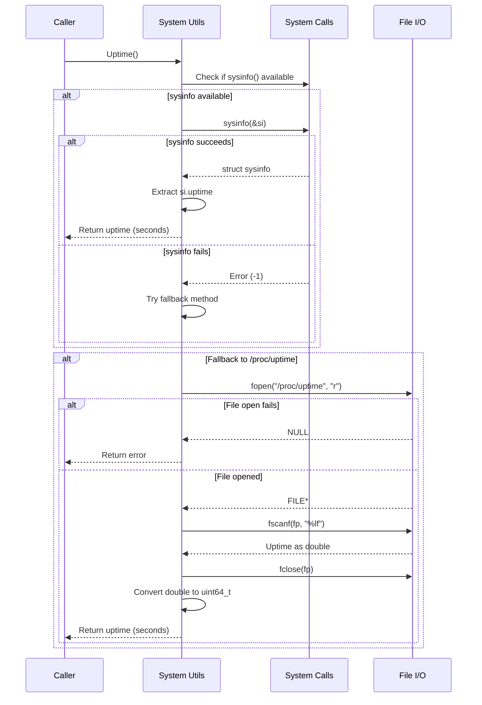
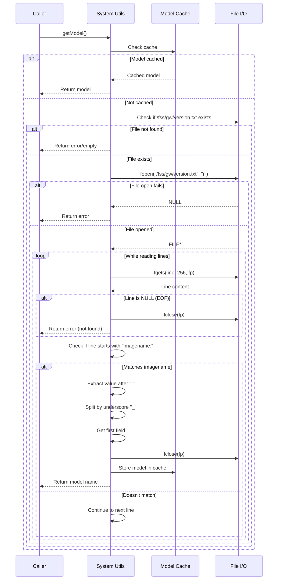
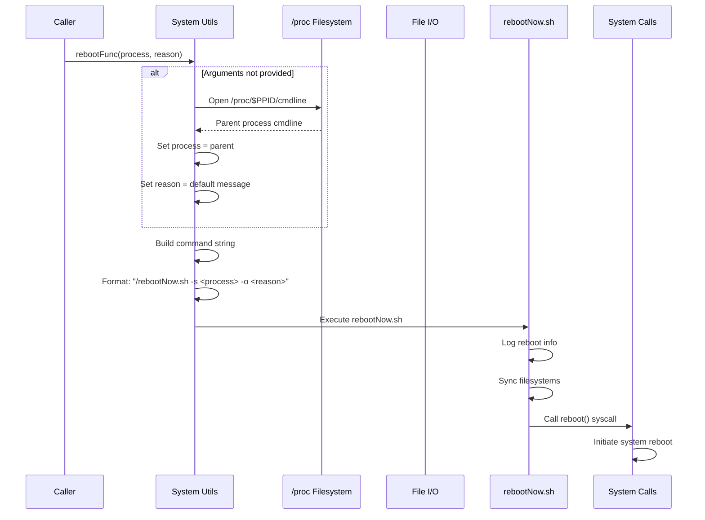

# Sequence Diagrams: uploadDumpsUtils.sh Migration

## Get MAC Address Sequence

### Mermaid Diagram



## Get IP Address Sequence

### Mermaid Diagram



## Get File Modification Time Sequence

### Mermaid Diagram



## Calculate SHA1 Checksum Sequence

### Mermaid Diagram



## Process Check Sequence

### Mermaid Diagram



## Get System Uptime Sequence

### Mermaid Diagram



## Get Device Model Sequence

### Mermaid Diagram



## Reboot System Sequence

### Mermaid Diagram



## Text-Based Sequence Diagram Alternative

### Get MAC Address Sequence (Text)

```
Caller -> Utils: getMacAddressOnly()

Utils -> Cache: Check cache

IF cache valid and fresh:
    Cache -> Utils: Cached MAC
    Utils -> Caller: Return MAC
ELSE:
    Utils -> WanInfo: Check if /etc/waninfo.sh exists
    
    IF waninfo.sh exists:
        WanInfo -> Utils: File exists
        Utils -> WanInfo: Source script
        Utils -> WanInfo: Call getWanInterfaceName()
        WanInfo -> Utils: Interface name (e.g., erouter0)
    ELSE:
        Utils -> Utils: Use default interface (erouter0)
    
    Utils -> System: Try getifaddrs()
    
    IF getifaddrs available:
        System -> Utils: ifaddrs list
        
        LOOP for each interface:
            Utils -> Utils: Check interface name matches
            
            IF match found:
                Utils -> Utils: Extract hwaddr from sockaddr
                Utils -> System: freeifaddrs()
                Utils -> Utils: Format MAC (remove colons, uppercase)
                Utils -> Cache: Update cache
                Utils -> Caller: Return MAC
    ELSE:
        Utils -> Socket: socket(AF_INET, SOCK_DGRAM)
        Socket -> Utils: Socket fd
        
        Utils -> Utils: Prepare ifreq struct
        Utils -> Utils: Set ifr_name = interface
        
        Utils -> Socket: ioctl(SIOCGIFHWADDR)
        Socket -> Utils: Hardware address
        
        Utils -> Socket: close(fd)
        
        Utils -> Utils: Extract hwaddr from ifreq
        Utils -> Utils: Format MAC (remove colons, uppercase)
        Utils -> Cache: Update cache
        Utils -> Caller: Return MAC
```

### Get File Modification Time Sequence (Text)

```
Caller -> Utils: getLastModifiedTimeOfFile(filepath)

Utils -> Utils: Validate filepath not NULL

IF filepath is NULL:
    Utils -> Caller: Return error

Utils -> System: stat(filepath, &st)

IF stat fails:
    System -> Utils: Error (-1)
    Utils -> Caller: Return error/empty
ELSE:
    System -> Utils: struct stat
    Utils -> Utils: Extract st.st_mtime
    
    Utils -> Time: localtime(&mtime)
    Time -> Utils: struct tm
    
    Utils -> Time: strftime(buffer, "%Y-%m-%d-%H-%M-%S")
    Time -> Utils: Formatted string
    
    Utils -> Caller: Return timestamp string
```

### Calculate SHA1 Checksum Sequence (Text)

```
Caller -> Utils: getSHA1(filepath)

Utils -> File: fopen(filepath, "rb")

IF file open fails:
    File -> Utils: NULL
    Utils -> Caller: Return error
ELSE:
    File -> Utils: FILE*
    
    Utils -> Crypto: SHA1_Init(&ctx)
    Crypto -> Utils: Initialized
    
    LOOP while data available:
        Utils -> File: fread(buffer, 8192)
        File -> Utils: Bytes read
        
        IF bytes read > 0:
            Utils -> Crypto: SHA1_Update(&ctx, buffer, bytes)
            Crypto -> Utils: Updated
    
    Utils -> Crypto: SHA1_Final(digest, &ctx)
    Crypto -> Utils: SHA1 digest (20 bytes)
    
    Utils -> File: fclose(fp)
    
    Utils -> Utils: Convert digest to hex string
    
    LOOP for each byte (20 bytes):
        Utils -> Utils: sprintf("%02x", digest[i])
    
    Utils -> Caller: Return SHA1 hash string
```

### Process Check Sequence (Text)

```
Caller -> Utils: processCheck(process_name)

Utils -> ProcFS: opendir("/proc")

IF directory open fails:
    ProcFS -> Utils: NULL
    Utils -> Caller: Return false (not running)
ELSE:
    ProcFS -> Utils: DIR*
    
    LOOP while reading entries:
        Utils -> ProcFS: readdir(proc_dir)
        ProcFS -> Utils: dirent entry
        
        IF entry is NULL:
            Utils -> ProcFS: closedir()
            Utils -> Caller: Return false (not found)
        
        Utils -> Utils: Check if entry name is numeric
        
        IF not numeric (not a PID):
            Utils -> Utils: Continue to next entry
        ELSE (is numeric):
            Utils -> Utils: Build path: /proc/<PID>/cmdline
            
            Utils -> File: fopen(cmdline_path, "r")
            
            IF file open fails:
                File -> Utils: NULL
                Utils -> Utils: Continue to next entry
            ELSE:
                File -> Utils: FILE*
                
                Utils -> File: fread(buffer, 1024)
                File -> Utils: Cmdline content
                
                Utils -> File: fclose(fp)
                
                Utils -> Utils: Search for process_name in cmdline
                
                IF process name found:
                    Utils -> ProcFS: closedir()
                    Utils -> Caller: Return true (running)
                ELSE:
                    Utils -> Utils: Continue to next entry
```

### Get System Uptime Sequence (Text)

```
Caller -> Utils: Uptime()

Utils -> System: Check if sysinfo() available

IF sysinfo available:
    Utils -> System: sysinfo(&si)
    
    IF sysinfo succeeds:
        System -> Utils: struct sysinfo
        Utils -> Utils: Extract si.uptime
        Utils -> Caller: Return uptime (seconds)
    ELSE:
        System -> Utils: Error (-1)
        Utils -> Utils: Try fallback method

IF fallback to /proc/uptime:
    Utils -> File: fopen("/proc/uptime", "r")
    
    IF file open fails:
        File -> Utils: NULL
        Utils -> Caller: Return error
    ELSE:
        File -> Utils: FILE*
        
        Utils -> File: fscanf(fp, "%lf")
        File -> Utils: Uptime as double
        
        Utils -> File: fclose(fp)
        
        Utils -> Utils: Convert double to uint64_t
        Utils -> Caller: Return uptime (seconds)
```

### Get Device Model Sequence (Text)

```
Caller -> Utils: getModel()

Utils -> Cache: Check cache

IF model cached:
    Cache -> Utils: Cached model
    Utils -> Caller: Return model
ELSE:
    Utils -> File: Check if /fss/gw/version.txt exists
    
    IF file not found:
        Utils -> Caller: Return error/empty
    ELSE:
        Utils -> File: fopen("/fss/gw/version.txt", "r")
        
        IF file open fails:
            File -> Utils: NULL
            Utils -> Caller: Return error
        ELSE:
            File -> Utils: FILE*
            
            LOOP while reading lines:
                Utils -> File: fgets(line, 256, fp)
                File -> Utils: Line content
                
                IF line is NULL (EOF):
                    Utils -> File: fclose(fp)
                    Utils -> Caller: Return error (not found)
                
                Utils -> Utils: Check if line starts with "imagename:"
                
                IF matches imagename:
                    Utils -> Utils: Extract value after ":"
                    Utils -> Utils: Split by underscore "_"
                    Utils -> Utils: Get first field
                    
                    Utils -> File: fclose(fp)
                    
                    Utils -> Cache: Store model in cache
                    Utils -> Caller: Return model name
                ELSE:
                    Utils -> Utils: Continue to next line
```

### Reboot System Sequence (Text)

```
Caller -> Utils: rebootFunc(process, reason)

IF arguments not provided:
    Utils -> ProcFS: Open /proc/$PPID/cmdline
    ProcFS -> Utils: Parent process cmdline
    Utils -> Utils: Set process = parent
    Utils -> Utils: Set reason = default message

Utils -> Utils: Build command string
Utils -> Utils: Format: "/rebootNow.sh -s <process> -o <reason>"

Utils -> Script: Execute rebootNow.sh
Script -> Script: Log reboot info
Script -> Script: Sync filesystems
Script -> System: Call reboot() syscall
System -> System: Initiate system reboot
```

## Summary of Utility Function Interactions

### Function Categories and Their Dependencies:

**Network Functions:**
- Use system calls: `getifaddrs()` or `ioctl()`
- Access: `/etc/waninfo.sh` (optional)
- Caching: MAC address cached for 60 seconds

**System Information Functions:**
- Use system calls: `sysinfo()` or read `/proc/uptime`
- Access: `/proc/<PID>/cmdline` for process check
- Access: `/fss/gw/version.txt` for model
- Caching: Model cached indefinitely

**File Functions:**
- Use system calls: `stat()` for metadata
- Use OpenSSL: SHA1 calculation
- Streaming: Read files in 8KB chunks for SHA1

**Reboot Function:**
- Access: `/proc/$PPID/cmdline` for caller info
- External: Calls `/rebootNow.sh` script
- System call: Eventually calls `reboot()`

### Key Patterns:
1. **Caching Pattern**: MAC and model cached to reduce system calls
2. **Fallback Pattern**: Multiple methods tried (getifaddrs → ioctl, sysinfo → /proc)
3. **Streaming Pattern**: Large files processed in chunks (SHA1)
4. **Configuration Pattern**: Optional config files checked before defaults

### Performance Characteristics:
- **Cached operations**: < 1ms
- **Network queries**: 5-20ms
- **File stat**: 1-10ms
- **Process check**: 20-100ms (depends on process count)
- **SHA1**: ~100ms per MB
- **Model lookup**: 10-50ms (first call), < 1ms (cached)
