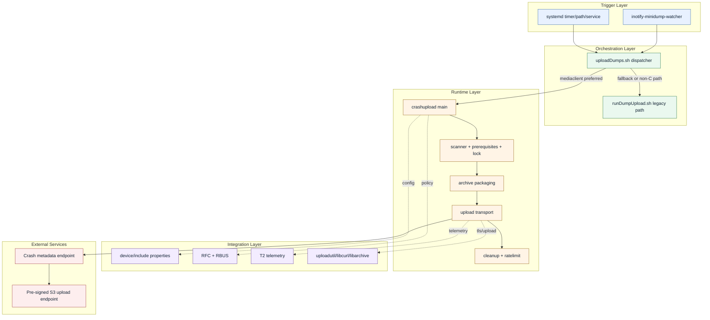
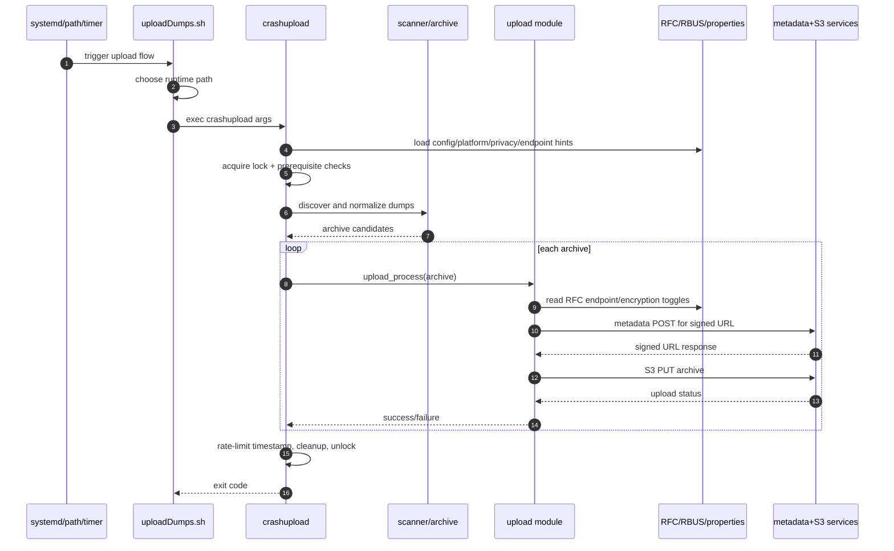
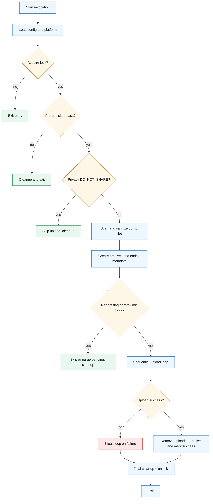
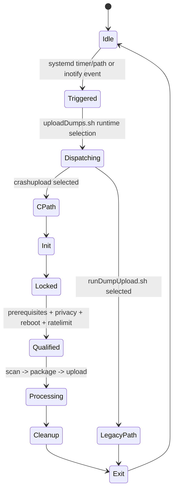
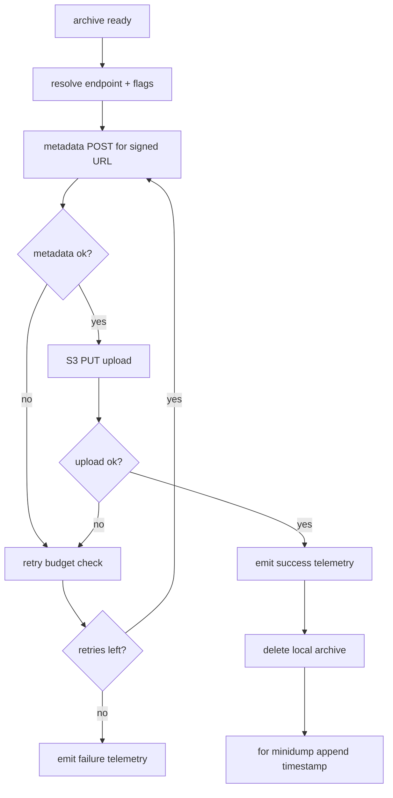

# Architecture Diagrams

## 1) System Context and Layering


## 2) Crash Upload Sequence (C Path)


## 3) Crash Processing Flowchart


## 4) Process Communication and State Files
```mermaid
flowchart LR
  classDef proc fill:#eaf3ff,stroke:#2c5282,color:#123;
  classDef state fill:#fff6db,stroke:#a16b00,color:#123;
  classDef data fill:#e9f7ef,stroke:#2f855a,color:#123;

  P1[systemd/inotify]:::proc --> P2[uploadDumps.sh]:::proc
  P2 -->|exec| P3[crashupload]:::proc
  P2 -->|fallback| P4[runDumpUpload.sh]:::proc

  S1[/tmp/.uploadMinidumps]:::state -. lock .-> P3
  S2[/tmp/.uploadCoredumps]:::state -. lock .-> P3
  S3[/tmp/.deny_dump_uploads_till]:::state -. policy .-> P3
  S4[/tmp/.minidump_upload_timestamps]:::state -. policy .-> P3
  S5[/tmp/set_crash_reboot_flag]:::state -. control .-> P3
  S6[/tmp/.on_startup_dumps_cleaned_up_*]:::state -. cleanup state .-> P3

  D1[/opt/minidumps or /minidumps]:::data --> P3
  D2[/var/lib/systemd/coredump]:::data --> P3
  D3[/opt/secure/*]:::data --> P3
```

## 5) Service/Runtime Lifecycle


## 6) Upload Execution Decision Flow

